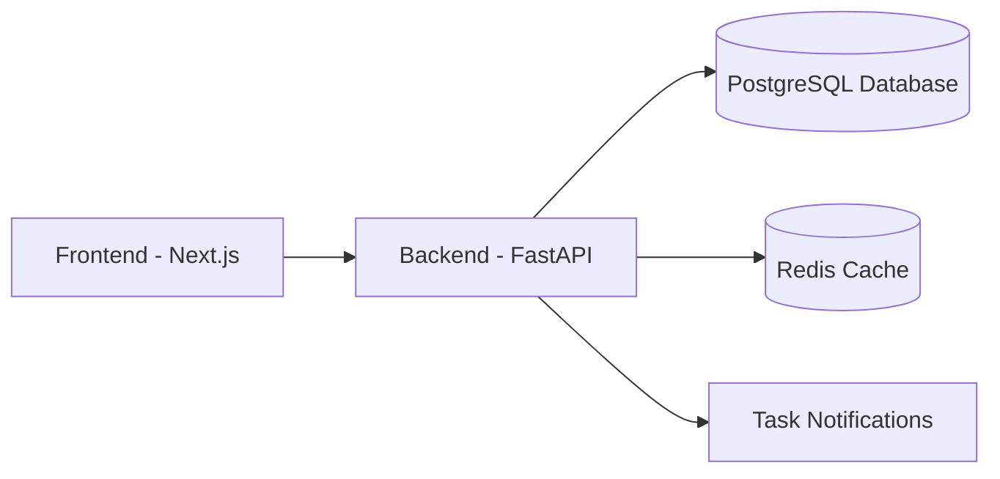

# TaskMaster


Effortlessly organize and track your tasks.

## Features

- ✓ User Registration
- ✓ User Authentication
- ✓ Create Task
- ✓ Edit Task
- ✓ Delete Task
- ✓ Task Completion
- ✓ Task Prioritization
- ✓ Task Notifications
- ✓ User Dashboard

## Quick Start

```bash
# Clone the repository
git clone https://github.com/example/taskmaster.git

# Navigate into the directory
cd taskmaster

# Start the application using Docker Compose
docker-compose up --build
```

## Prerequisites

| Tool        | Version    |
|-------------|------------|
| Docker      | 20.10+     |
| Docker-Compose | 1.29+   |
| Node.js     | 18.0+      |

## Docker Compose Setup

```yaml
version: '3.8'
services:
  app:
    build: .
    ports:
      - "8000:8000"
    environment:
      POSTGRES_DB: taskmaster
      POSTGRES_USER: user
      POSTGRES_PASSWORD: password
    depends_on:
      - db
  db:
    image: postgres:15
    environment:
      POSTGRES_USER: user
      POSTGRES_PASSWORD: password
    volumes:
      - postgres_data:/var/lib/postgresql/data

volumes:
  postgres_data:
```

## API Usage Examples

```bash
# Register a new user
curl -X POST http://localhost:8000/api/v1/auth/register \
  -H "Content-Type: application/json" \
  -d '{"email": "user@example.com", "password": "yourpassword"}'

# Login and receive tokens
curl -X POST http://localhost:8000/api/v1/auth/login \
  -H "Content-Type: application/json" \
  -d '{"email": "user@example.com", "password": "yourpassword"}'
```

## Environment Variables

| Name             | Required | Default   | Description                          |
|------------------|----------|-----------|--------------------------------------|
| `POSTGRES_DB`    | yes      | taskmaster| Name of the PostgreSQL database      |
| `POSTGRES_USER`  | yes      | user      | PostgreSQL user                      |
| `POSTGRES_PASSWORD`| yes    | password  | User password for PostgreSQL         |

## Architecture Diagram



## Tech Stack

| Component    | Technology        |
|--------------|-------------------|
| Backend      | Python, FastAPI   |
| Frontend     | Next.js, TypeScript|
| UI Library   | Tailwind CSS      |
| State Management | React Query, Zustand |
| Database     | PostgreSQL, Redis |
| Infrastructure | Docker, Nginx   |

## Links

- [Full Documentation](./docs)